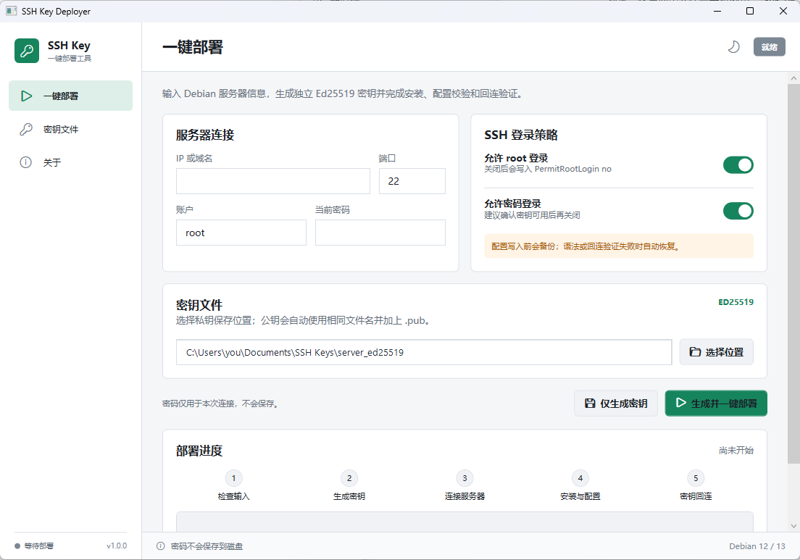

# SSH Key Deployer

[](https://github.com/tuolaji996/windows-ssh-key-deployer/actions/workflows/ci.yml)
[](LICENSE)
[](https://github.com/tuolaji996/windows-ssh-key-deployer/releases/latest)

[English](#english) | [简体中文](#简体中文)

<p align="center">
  
</p>
<p align="center">
  <sub>Current Simplified Chinese interface / 当前简体中文界面. The example private-key path is anonymized / 示例私钥路径已脱敏。</sub>
</p>

## English

SSH Key Deployer is a Windows and macOS Apple Silicon desktop application for creating an independent Ed25519 SSH key pair and deploying it to Debian servers you own or are authorized to administer. It is designed for the common first-login workflow: connect with an account and password, install the public key, choose SSH login policies, validate the server configuration, and confirm that key login works.

### Features

- Generates separate Ed25519 private and public key files; Windows restricts the private-key ACL and macOS restricts it to owner read/write (`0600`).
- Requests explicit approval of the SSH host-key fingerprint on first contact or when it changes.
- Installs the public key in `authorized_keys` and can enable or disable root login and password authentication.
- Backs up affected SSH settings, checks `sshd` syntax and effective configuration, reloads SSH, and verifies a new key-based login. It attempts rollback when a deployment step fails.
- Keeps the password in memory only for the current connection; it is not written to configuration files or logs.
- Includes Simplified Chinese and English UI switching, light and dark themes, and a local key-file view.

### Requirements

- Windows 10 or Windows 11, x64; or macOS 12+ on Apple Silicon (M1 or later).
- Windows OpenSSH Client, including `ssh-keygen.exe`; macOS uses the system `/usr/bin/ssh-keygen`.
- A Debian 12 or Debian 13 server running OpenSSH Server.
- An initial SSH account and password, plus root or `sudo` access when changing SSH policy.

### Install on Windows

Download the `win-x64` ZIP and matching `.sha256` file from [Releases](https://github.com/tuolaji996/windows-ssh-key-deployer/releases/latest). Verify the checksum before extracting and running `SshKeyDeployer.exe`:

```powershell
Get-FileHash .\SSH-Key-Deployer-*-win-x64.zip -Algorithm SHA256
```

You can also install a selected release using the repository script:

```powershell
powershell.exe -NoProfile -ExecutionPolicy Bypass -File .\install.ps1 -Version 1.2.0
```

By default, the application is installed under `%LOCALAPPDATA%\Programs\SSH Key Deployer` and does not require administrator privileges.

### Install on macOS Apple Silicon

Download the `osx-arm64` ZIP and matching `.sha256` file from [Releases](https://github.com/tuolaji996/windows-ssh-key-deployer/releases/latest), then verify and open the app:

```bash
shasum -a 256 SSH-Key-Deployer-*-osx-arm64.zip
unzip SSH-Key-Deployer-*-osx-arm64.zip
open "SSH Key Deployer.app"
```

The current macOS package is an unsigned technical preview because no Apple Developer signing/notarization credential is stored in this project. Gatekeeper may require an explicit confirmation in **System Settings → Privacy & Security**. Only do that after the SHA-256 matches the released sidecar file and you trust this project.

### Deploy a key

1. Enter the server host name or IP address, SSH port, account name, and current password.
2. Choose where to save the new private key, then select the desired root-login and password-authentication policies.
3. Compare the displayed host-key fingerprint through an independent channel, such as the provider console, before approving it.
4. Start deployment and wait until the key-login verification succeeds. Keep your existing server console or SSH session open until that check completes.

Use this application only for servers you own or have explicit permission to manage. Cancel the deployment if a host fingerprint is unexpected or does not match your independent verification.

### Build from source

Install the .NET 8 SDK. On Windows, use Windows PowerShell 5.1 or PowerShell 7:

```powershell
.\build.ps1
.\scripts\scan-secrets.ps1
```

Create a self-contained, single-file `win-x64` package with:

```powershell
.\release.ps1 -Version 1.2.0
```

The ZIP archive and checksum are written to `artifacts/`.

On macOS, build the self-contained Apple Silicon `.app` package with:

```bash
./scripts/package-macos.sh 1.2.0
```

The macOS ZIP and checksum are also written to `artifacts/`.

### Security and license

Report security concerns privately according to [SECURITY.md](SECURITY.md). This project is released under the [MIT License](LICENSE).

---

## 简体中文

SSH Key Deployer 是一款支持 Windows 和 macOS Apple Silicon 的桌面工具，用于生成独立的 Ed25519 SSH 密钥对，并部署到你拥有或获得明确授权管理的 Debian 服务器。它覆盖常见的首次登录流程：使用账户和密码连接、安装公钥、选择 SSH 登录策略、检查服务器配置，并验证密钥登录是否成功。

### 主要功能

- 在本机生成独立的 Ed25519 私钥和公钥文件；Windows 会收紧私钥 ACL，macOS 会将私钥限制为仅当前用户可读写（`0600`）。
- 首次连接或主机密钥发生变化时，要求用户明确核对和确认 SSH 主机指纹。
- 将公钥安装到 `authorized_keys`，并可选择开启或关闭 root 登录和密码登录。
- 备份受影响的 SSH 设置，检查 `sshd` 语法和有效配置，重载 SSH，并验证新密钥能够登录；部署步骤失败时会尝试回滚。
- 密码只用于当前连接，既不会写入配置，也不会记录到日志。
- 支持简体中文和英文界面切换，并提供亮色、深色主题和本机密钥文件查看入口。

### 系统要求

- Windows 10 或 Windows 11，x64；或搭载 Apple Silicon（M1 及以上）的 macOS 12+。
- Windows 需要安装 Windows OpenSSH Client（含 `ssh-keygen.exe`）；macOS 使用系统自带的 `/usr/bin/ssh-keygen`。
- 目标服务器为运行 OpenSSH Server 的 Debian 12 或 Debian 13。
- 首次连接所需的账户和密码；修改 SSH 策略时还需要 root 或 `sudo` 权限。

### Windows 安装

从 [Releases](https://github.com/tuolaji996/windows-ssh-key-deployer/releases/latest) 下载 `win-x64` ZIP 压缩包及对应的 `.sha256` 文件。核对哈希后，解压并运行 `SshKeyDeployer.exe`：

```powershell
Get-FileHash .\SSH-Key-Deployer-*-win-x64.zip -Algorithm SHA256
```

也可以使用仓库中的脚本安装指定版本：

```powershell
powershell.exe -NoProfile -ExecutionPolicy Bypass -File .\install.ps1 -Version 1.2.0
```

默认会安装到当前用户的 `%LOCALAPPDATA%\Programs\SSH Key Deployer`，不需要管理员权限。

### macOS Apple Silicon 安装

从 [Releases](https://github.com/tuolaji996/windows-ssh-key-deployer/releases/latest) 下载 `osx-arm64` ZIP 压缩包及对应的 `.sha256` 文件，核对哈希后解压并打开：

```bash
shasum -a 256 SSH-Key-Deployer-*-osx-arm64.zip
unzip SSH-Key-Deployer-*-osx-arm64.zip
open "SSH Key Deployer.app"
```

当前 macOS 包是未签名的技术预览版：仓库中没有保存 Apple Developer 签名或公证凭据。Gatekeeper 可能要求你在 **系统设置 → 隐私与安全性** 中明确确认。只有在 SHA-256 与发布页的同名校验文件一致，并且你确认信任该项目时才这样做。

### 部署密钥

1. 填写服务器域名或 IP、SSH 端口、账户和当前密码。
2. 选择新私钥的保存位置，并设定 root 登录和密码登录策略。
3. 通过独立渠道核对显示的主机指纹，例如云服务商控制台，确认无误后再继续。
4. 启动部署，等待密钥回连验证成功。在验证完成前，请保留现有服务器控制台或 SSH 会话。

本工具仅可用于你拥有或获得明确授权的服务器。遇到意外的主机指纹或无法独立核对的指纹时，请取消部署。

### 从源码构建

安装 .NET 8 SDK。Windows 下使用 Windows PowerShell 5.1 或 PowerShell 7，然后执行：

```powershell
.\build.ps1
.\scripts\scan-secrets.ps1
```

生成自包含、单文件的 `win-x64` 发布包：

```powershell
.\release.ps1 -Version 1.2.0
```

ZIP 包和哈希文件会输出到 `artifacts/`。

macOS 下可使用下面的命令生成自包含的 Apple Silicon `.app` 包：

```bash
./scripts/package-macos.sh 1.2.0
```

macOS ZIP 包和哈希文件同样会输出到 `artifacts/`。

### 安全与许可证

安全问题请按 [SECURITY.md](SECURITY.md) 私密报告。本项目采用 [MIT License](LICENSE)。
